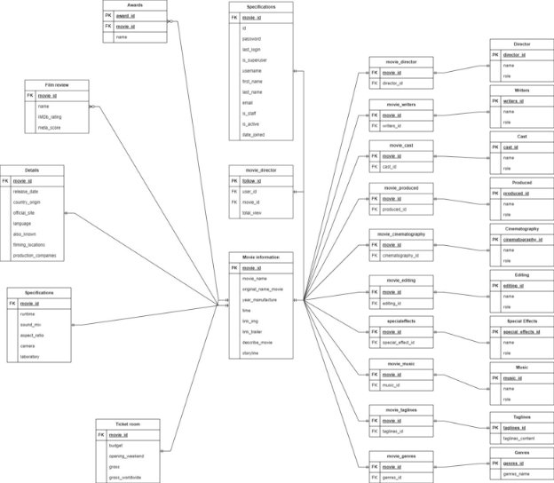



Họ - tên: Trần Hồng Quân
MSSV: 20205114
**Báo cáo GR1**

Giảng viên: Trương Thị Diệu Linh

**Chủ đề GR1: Website quản lý thông tin phim **ảnh**.** 

**Đặc tả chức năng website, crawl data, thiết kế database, fill dữ liệu vào database.**
**

# **Mục lục**
[1.	Đặc tả chức năng	3****](#_toc156540653)

[**1.1.	Usecase:	3****](#_toc156540654)

[**1.2.	Data:	4****](#_toc156540655)

[**1.3.	Sơ đồ URD	9****](#_toc156540656)

[**2.	Đặc tả Usecase:	10****](#_toc156540657)

[**2.1.	Đặc tả use case UC001 “Đăng ký”	10****](#_toc156540658)

[**2.2.	Đặc tả usecase UC002 “Đăng nhập”	11****](#_toc156540659)

[**2.3.	Đặc tả use case UC003 “Đổi mật khẩu”	12****](#_toc156540660)

[**2.4.	Đặc tả use case UC004 “Quên mật khẩu”	13****](#_toc156540661)

[**2.5.	Đặc tả use case UC005 “Tìm kiếm phim”	14****](#_toc156540662)

[**2.6.	Đặc tả use case UC006 “Xem thông tin các phim”	15****](#_toc156540663)

[**2.7.	Đặc tả use case UC007 “Lọc phim”	15****](#_toc156540664)

[**2.8.	Đặc tả use case UC008 “Đánh giá phim”	15****](#_toc156540665)

[**2.9.	Đặc tả use case UC009 “Chỉnh sửa thông tin cá nhân”	16****](#_toc156540666)

[**2.10.	Đặc tả use case UC010 “Đánh dấu phim mình thích”	17****](#_toc156540667)

[**2.11.	Đặc tả use case UC011 “Đăng xuất”	17****](#_toc156540668)

[**2.12.	Đặc tả use case UC012 “Xem thông báo”	18****](#_toc156540669)

[**2.13.	Đặc tả use case UC013 “Thêm, sửa, xóa và cập nhật thông tin phim”	18****](#_toc156540670)

[**2.14.	Đặc tả use case UC014 “Thêm, sửa, xóa và cập nhật thông tin người dùng”	20****](#_toc156540671)

[**2.15.	Đặc tả use case UC015 “Xem báo cáo số lượng người tạo tài khoản”	20****](#_toc156540672)

[**2.16.	Đặc tả use case UC016 “Xem phim được tìm hiểu nhiều nhất”	21****](#_toc156540673)

[**3.	Công nghệ và sản phẩm	22****](#_toc156540674)

[**3.1.	Công nghệ sử dụng	22****](#_toc156540675)

[**3.2.	Kết quả	22****](#_toc156540676)

[**Movie:	23****](#_toc156540677)

[**Director:	24****](#_toc156540678)

[**Cast:	25****](#_toc156540679)

[**Rating:	25****](#_toc156540680)

[**Film_review:	26****](#_toc156540681)

[**Ticket_room:	27****](#_toc156540682)

**

1. **Đặc tả chức năng**
   1. **Usecase:**

Gồm 3 actor: Admin, user, guest

Guest:

- Đăng ký
- Tìm kiếm phim
- Xem thông tin các phim
- Sắp xếp phim dựa vào yếu tố: Đánh giá, alpha, thời lượng, …
- Lọc phim được xem nhiều nhất (đánh dấu phim được xem nhiều nhất dựa vào sự kiện người dùng ứng dụng khi click vào chi tiết phim, GR3)

User kế thừa Guest:

- Đánh giá, comment phim
- Chỉnh sửa thông tin cá nhân
- Đánh dấu phim mình thích vào list
- Quên mật khẩu
- Đổi mật khẩu
- Đăng xuất
- Xem thông báo: Phim thịnh hành, Phim yêu thích vừa thêm, 

Admin:

- Thêm, sửa, xóa và cập nhật thông tin phim
- Thêm, sửa, xóa và cập nhật thông tin người dùng
- Xem báo cáo số lượng người vừa tạo tài khoản
- Xem phim nào được tìm hiểu nhiều nhất (ứng dụng GR3)

1. **Data:**

Movie information: Thông tin phim

\- movie\_id: ID phim

\- movie\_name: Tên phim 

\- original\_name\_movie: Tên gốc của phim

\- year\_manufacture: Năm sản xuất

\- time: Thời lượng

\- link\_img: Ảnh nền

\- link\_trailer

\- describe: Mô tả

\- storyline: Cốt truyện

Director: Đạo diễn 

\- director\_id

\- name

\- role

Cast: Diễn viên

\- cast\_id

\- name

\- role

Produced: Sản xuất

\- produced\_id

\- name

\- role

Cinematography

\- cinematography\_id

\- name

\- role

Editing

\- editing\_id

\- name

\- role

Special Effects: Hiệu ứng đặc biệt

\- special\_effects\_id

\- name

\- role

Music

\- music\_id

\- name

\- role

Taglines

\- taglines\_id

\- taglines\_content: Khẩu hiệu

Genres: Thể loại

\- genres\_id

\- genres\_name

Did\_you\_know: Bạn có biết ?

\- did\_you\_know\_id

\- movie\_id: ID phim

\- name: Tên người viết

\- content: Nội dung

!!!!!!!!!!!!!!!

Bảng trung gian: Gồm movie\_id và ...id

movie\_cast

movie\_cinematography

movie\_director

movie\_editing

movie\_genres

movie\_music

movie\_produced

movie\_specialeffects

movie\_taglines

movie\_writers

!!!!!!!!!!!!!!!

Details: Chi tiết

\- movie\_id: ID phim

\- release\_date: Ngày phát hành

\- country\_origin: Quốc gia xuất xứ

\- official\_site: Web phát hành chính thức

\- language: Ngôn ngữ

\- also\_known: Tên khác của phim

\- filming\_locations: Địa điểm quay phim

\- production\_companies: Công ty sản xuất

Specifications: Thông số kỹ thuật

\- movie\_id: ID phim

\- runtime: Thời gian

\- sound\_mix: Trộn âm thanh

\- aspect\_ratio: Tỷ lệ khung hình

\- camera: Máy ảnh

\- laboratory: Phòng thí nghiệm

Ticket room: Phòng vé

\- movie\_id: ID phim

\- budget: Ngân sách

\- opening\_weekend: Tuần đầu tiên

\- gross: Tổng trong nước

\- gross\_worldwide: Tổng trên thế giới

Awards: Các giải thưởng

\- award\_id

\- movie\_id: ID phim

\- name: Tên giải thưởng

Film review: Đánh giá phim

\- movie\_id: ID phim

\- IMDb\_rating: Xếp hạng IMDb

\- meta\_score: Đánh giá người dùng

Auth\_user:

- Id
- Password
- Last\_login
- Is\_superuser: Check xem là admin hay người thường
- Username
- First\_name
- Last\_name
- Email
- Is\_staff
- Is\_active
- Date\_joined

Follow\_film\_user: Theo dõi người dùng xem phim nào nhiều nhất

- Follow\_id
- movie\_id
- user\_id
- total\_view: Số lần xem 1 phim

1. **Sơ đồ URD**

1. **Đặc tả Usecase:**
   1. Đặc tả use case UC001 “Đăng ký”

|**Mã Use case**|UC001|**Tên Use case**|Đăng ký|
| :- | - | :- | - |
|**Tác nhân**|Guest|||
|**Tiền điều kiện**|Người dùng chưa có tài khoản|||
|
**Luồng sự kiện chính**

**(Thành công)**
||||

|**STT**|**Thực hiện bởi**|**Hành động**|
| - | :-: | :-: |
||Guest|Người dùng truy cập trang đăng ký tài khoản.|
||Hệ thống|Hệ thống hiển thị form đăng ký với các trường thông tin bắt buộc: họ tên, địa chỉ email, số điện thoại, mật khẩu.|
||Guest|Người dùng nhập đầy đủ thông tin vào các trường và ấn nút "Đăng ký".|
||Hệ thống|Hệ thống kiểm tra thông tin và xác nhận đăng ký thành công.|
|5\.|Hệ thống|Hệ thống gửi email hoặc tin nhắn SMS để xác nhận đăng ký tới người dùng.|
|6\.|Guest|Người dùng mở email hoặc tin nhắn SMS và ấn vào đường link xác nhận.|
|7\.|Hệ thống|Hệ thống xác nhận đăng ký thành công và hiển thị trang chào mừng tới người dùng.|

|||||
| :- | :- | :- | :- |
|**Luồng sự kiện thay thế**||||

|**STT**|**Thực hiện bởi**|**Hành động**|
| - | :-: | :-: |
|8a.|Hệ thống|Hệ thống hiển thị thông báo lỗi và yêu cầu người dùng nhập lại thông tin đăng ký.|
|8b.|Hệ thống|Người dùng sửa thông tin và ấn nút "Đăng ký" để tiếp tục quá trình đăng ký.|
|9a.|Hệ thống|Hệ thống hiển thị thông báo lỗi và yêu cầu người dùng nhập lại thông tin đăng ký với email hoặc số điện thoại khác.|
|9b.|Hệ thống|Người dùng nhập lại thông tin và ấn nút "Đăng ký" để tiếp tục quá trình đăng ký.|

|||||
| :- | :- | :- | :- |
|**Hậu điều kiện**|Không|||

|**STT**|**Trường    dữ liệu**|**Mô tả**|**Bắt buộc?**|**Điều kiện hợp lệ**|**Ví dụ**|
| :-: | :-: | :-: | :-: | :-: | :-: |
||Họ và tên|Tên đầy đủ của người dùng|Có|Không được để trống|Trần Hồng Quân|
|

2\.
|Địa chỉ email|Địa chỉ email của người dùng|Có|Phải đúng định dạng email|Anhquankaka113@gmail.com|
|3\.|Số điện thoại|Số điện thoại của người dùng|Không|Phải đúng định dạng số|(+84)123456789|
|4\.|Tên đăng nhập|Tên đăng nhập để truy cập vào hệ thống|Có|Giá trị không được để trống, không chứa ký tự đặc biệt hoặc khoảng trắng|username123|
|5\.|Mật khẩu|Mật khẩu của người dùng|Có|Giá trị không được để trống, độ dài tối thiểu 8 ký tự, phải bao gồm cả chữ hoa, chữ thường, số và ký tự đặc biệt|Abc@123|
|6\.|Địa chỉ|Địa chỉ của người dùng|Có|Không được để trống|Thanh Chương, Nghệ An|
|7\.|Ngày sinh|Ngày sinh của người dùng|Không|Phải đúng định dạng|07/08/2002|
|8\.|Giới tính|Giới tính của người dùng|Không|Chỉ được chọn Nam hoặc Nữ|Nam|

1. Đặc tả usecase UC002 “Đăng nhập”

|**Mã Use case**|UC002|**Tên Use case**|Đăng nhập|
| :- | - | :- | - |
|**Tác nhân**|User|||
|**Tiền điều kiện**|Người dùng đã có tài khoản trên hệ thống.|||
|
**Luồng sự kiện chính**

**(Thành công)**
||||

|**STT**|**Thực hiện bởi**|**Hành động**|
| - | :-: | :-: |
|1\.|Người dùng|Người dùng truy cập trang đăng nhập (login page).|
|2\.|Hệ thống|Hệ thống hiển thị giao diện đăng nhập yêu cầu người dùng nhập thông tin đăng nhập (username và password).|
|3\.|Người dùng|Người dùng nhập thông tin đăng nhập và bấm nút "Đăng nhập".|
|4\.|Hệ thống|Hệ thống xác thực thông tin đăng nhập của người dùng.|
||Hệ thống|Nếu thông tin đăng nhập chính xác, hệ thống cho phép người dùng truy cập vào tài khoản và chuyển hướng người dùng đến trang chính (home page).|
||Hệ thống|Nếu thông tin đăng nhập không chính xác, hệ thống hiển thị thông báo lỗi và yêu cầu người dùng nhập lại thông tin đăng nhập.|

|||||
| :- | - | :- | :- |
|**Luồng sự kiện thay thế**||||

|**STT**|**Thực hiện bởi**|**Hành động**|
| - | :-: | :-: |
|3a.|Người dùng|Nếu người dùng quên mật khẩu, họ có thể yêu cầu đặt lại mật khẩu bằng cách nhấn vào liên kết "Quên mật khẩu" trên trang đăng nhập.|
|4a.|Hệ thống|Nếu tên đăng nhập không tồn tại trong hệ thống, hệ thống hiển thị thông báo lỗi và yêu cầu người dùng nhập lại thông tin đăng nhập.|
|5a.|Hệ thống|Nếu mật khẩu nhập vào không chính xác, hệ thống hiển thị thông báo lỗi và yêu cầu người dùng nhập lại thông tin đăng nhập.|

|||||
| :- | - | :- | :- |
|**Hậu điều kiện**||||

1. Đặc tả use case UC003 “Đổi mật khẩu”

|**Mã Use case**|UC003|**Tên Use case**|Đổi mật khẩu|
| :- | - | :- | - |
|**Tác nhân**|User, Admin|||
|**Tiền điều kiện**|Người dùng đã đăng nhập vào tài khoản của mình.|||
|
**Luồng sự kiện chính**

**(Thành công)**
||||

|**STT**|**Thực hiện bởi**|**Hành động**|
| - | :-: | :-: |
|1\.|Người dùng|Người dùng truy cập vào trang đổi mật khẩu.|
|2\.|Hệ thống|Hệ thống hiển thị trang đổi mật khẩu và yêu cầu người dùng nhập mật khẩu hiện tại và mật khẩu mới.|
|3\.|Người dùng|Người dùng nhập mật khẩu hiện tại và mật khẩu mới.|
|4\.|Người dùng|Người dùng xác nhận thông tin đã nhập và gửi yêu cầu đổi mật khẩu.|
|5\.|Hệ thống|Hệ thống kiểm tra tính hợp lệ của mật khẩu hiện tại và mật khẩu mới.|
|6\.|Hệ thống|Nếu thông tin nhập vào không hợp lệ, hệ thống hiển thị thông báo lỗi và yêu cầu người dùng nhập lại thông tin.|
|7\.|Hệ thống|Nếu thông tin nhập vào hợp lệ, hệ thống cập nhật mật khẩu mới vào tài khoản của người dùng.|
|8\.|Hệ thống|Hệ thống hiển thị trang thông báo thành công hoặc trang đăng nhập.|

|||||
| :- | - | :- | :- |
|**Luồng sự kiện thay thế**||||

|**STT**|**Thực hiện bởi**|**Hành động**|
| - | :-: | :-: |
|9a.|Hệ thống|Nếu người dùng nhập sai mật khẩu cũ, hệ thống sẽ hiển thị thông báo lỗi và yêu cầu người dùng nhập lại mật khẩu cũ|
|9b.|Hệ thống|Nếu người dùng không nhập mật khẩu mới hoặc xác nhận sai mật khẩu mới, hệ thống sẽ hiển thị thông báo lỗi và yêu cầu người dùng nhập lại mật khẩu mới và xác nhận|

|||||
| :- | - | :- | :- |
|**Hậu điều kiện**||||

1. Đặc tả use case UC004 “Quên mật khẩu”

|**Mã Use case**|UC004|**Tên Use case**|Quên mật khẩu|
| :- | - | :- | - |
|**Tác nhân**|User, Admin|||
|**Tiền điều kiện**|Người dùng đã đăng nhập vào tài khoản của mình.|||
|
**Luồng sự kiện chính**

**(Thành công)**
||||

|**STT**|**Thực hiện bởi**|**Hành động**|
| - | :-: | :-: |
|1\.|Người dùng|Người dùng truy cập vào trang quên mật khẩu|
|2\.|Hệ thống|Hệ thống hiển thị trang quên mật khẩu và yêu cầu người dùng nhập mật khẩu hiện tại|
|3\.|Người dùng|Người dùng nhập email của tài khoản đăng nhập|
|4\.|Hệ thống|Hệ thống kiểm tra email có chính xác không rồi gửi mã về email. Sau đó hiển thị trang nhập mã|
|5\.|Người dùng|Vào emai lấy mã và nhập mã|
|6\.|Hệ thống|Hệ thống hiển thị trang đổi mật khẩu nếu mã đúng|
|7\.|Người dùng|Nhập mật khẩu mới và xác nhận|
|8\.|Hệ thống|Thông báo thành công và đổi mật khẩu trong database|

|||||
| :- | - | :- | :- |
|**Luồng sự kiện thay thế**||||

|**STT**|**Thực hiện bởi**|**Hành động**|
| - | :-: | :-: |
|6a.|Hệ thống|Nếu người dùng nhập sai mật khẩu email, hệ thống sẽ hiển thị thông báo lỗi và yêu cầu người dùng nhập lại email|
|8a.|Hệ thống|Nếu người dùng nhập mật khẩu không hợp lệ thì yêu cầu nhập lại|

|||||
| :- | - | :- | :- |
|**Hậu điều kiện**||||

1. Đặc tả use case UC005 “Tìm kiếm phim”

|**Mã Use case**|UC005|**Tên Use case**|Tìm kiếm phim|
| :- | - | :- | - |
|**Tác nhân**|Guest, User, Admin|||
|**Tiền điều kiện**|Không có|||
|
**Luồng sự kiện chính**

**(Thành công)**
||||

|**STT**|**Thực hiện bởi**|**Hành động**|
| - | :-: | :-: |
|1\.  |Người dùng|Yêu cầu chức năng tìm kiếm phim|
|2\.|Hệ thống|Hiển thị thanh tìm kiếm phía trên giao diện|
|3\.|Người dùng|Nhập thông tin cần tìm kiếm và chọn nút tìm kiếm|
|4\.|Hệ thống|Thực hiện tìm kiếm trong cơ sở dữ liệu của người dùng và hiển thị danh sách kết quả tìm kiếm thỏa mãn điều kiện|
|5\.|Người dùng|Chọn phim cần xem thông tin chi tiết|
|6\.|Hệ thống|HIển thị giao diện thông tin chi tiết của phim như ảnh, đạo diễn, diễn viên, đánh giá, comment, …|

|||||
| :- | - | :- | :- |
|**Luồng sự kiện thay thế**||||

|**STT**|**Thực hiện bởi**|**Hành động**|
| :-: | :-: | :-: |

|||||
| :- | - | :- | :- |
|**Hậu điều kiện**|Không|||

- Dữ liệu đầu vào khi tìm kiếm

|**STT**|**Trường    dữ liệu**|**Mô tả**|**Bắt buộc?**|**Điều kiện hợp lệ**|**Ví dụ**|
| :-: | :-: | :-: | :-: | :-: | :-: |
||Tên phim|Tên của phim cần tím kiếm|Không|Chỉ cần gõ tối thiểu 1 chữ|Iron|

- Dữ liệu đầu ra khi tìm kiếm

|**STT**|**Trường    dữ liệu**|**Mô tả**|**Định dạng hiển thị**|**Ví dụ**|
| :-: | :-: | :-: | :-: | :-: |
||Tên phim||||
||Đạo diễn||||
||Diễn viên||||
||Thời lượng||||
||Mô tả chi tiết||||

1. Đặc tả use case UC006 “Xem thông tin các phim”
- Ở use case UC005 là tiền điều kiện để thực hiện use case UC006

1. Đặc tả use case UC007 “Lọc phim”

|**Mã Use case**|UC007|**Tên Use case**|Lọc phim|
| :- | - | :- | - |
|**Tác nhân**|Guest, User, Admin|||
|**Tiền điều kiện**|Không có|||
|
**Luồng sự kiện chính**

**(Thành công)**
||||

|**STT**|**Thực hiện bởi**|**Hành động**|
| - | :-: | :-: |
|1\.|Người dùng|Click chuột vào mục lọc phim và chọn chức năng để lọc|
|2\.|Hệ thống|Hệ thống kiểm tra xem người dùng đã chọn chức năng nào và tiến hành lọc sau đó đưa ra màn hình kết quả sau khi lọc|

|||||
| :- | - | :- | :- |
|**Luồng sự kiện thay thế**||||

|**STT**|**Thực hiện bởi**|**Hành động**|
| - | :-: | :-: |

|||||
| :- | - | :- | :- |
|**Hậu điều kiện**||||

1. Đặc tả use case UC008 “Đánh giá phim”

|**Mã Use case**|UC008|**Tên Use case**|Đánh giá phim|
| :- | - | :- | - |
|**Tác nhân**|User|||
|**Tiền điều kiện**|Khách đăng nhập thành công với vai trò là User|||
|
**Luồng sự kiện chính**

**(Thành công)**
||||

|**STT**|**Thực hiện bởi**|**Hành động**|
| - | :-: | :-: |
|1\.  |Người dùng|Chọn chức năng Đánh giá phim sau khi vào xem chi tiết phim|
|2\.  |Hệ thống|Hiển thị ra giao diện đánh giá|
|3\. |Người dùng|Chọn số sao đánh giá và viết comment, sau đó nhấn gửi|
|4\. |Hệ thống|Thông báo đánh giá thành công và quay về màn hình chi tiết phim đó|

|||||
| :- | - | :- | :- |
|**Luồng sự kiện thay thế**||||

|**STT**|**Thực hiện bởi**|**Hành động**|
| - | :-: | :-: |
|4a.|Hệ thống|Thông báo lỗi: Cần đánh giá số sao nếu Người dùng không đánh giá sao (không điền vào ô comment cũng không sao)|

|||||
| :- | - | :- | :- |
|**Hậu điều kiện**|Không|||

1. Đặc tả use case UC009 “Chỉnh sửa thông tin cá nhân”

|**Mã Use case**|UC009|**Tên Use case**|Chỉnh sửa thông tin cá nhân|
| :- | - | :- | - |
|**Tác nhân**|Guest, Admin|||
|**Tiền điều kiện**|Người dùng đã đăng nhập vào hệ thống và có thông tin cá nhân cần cập nhật.|||
|
**Luồng sự kiện chính**

**(Thành công)**
||||

|**STT**|**Thực hiện bởi**|**Hành động**|
| - | :-: | :-: |
|1\.|Người dùng|Người dùng truy cập vào trang cập nhật thông tin cá nhân|
|2\.|Hệ thống|Hệ thống hiển thị form thông tin cá nhân hiện tại của người dùng.|
|3\.|Người dùng|Người dùng thay đổi hoặc bổ sung thông tin cá nhân cần cập nhật trên form.|
|4\.|Người dùng|Người dùng xác nhận thông tin đã nhập chính xác và yêu cầu cập nhật.|
|5\.|Hệ thống|Hệ thống kiểm tra và lưu thông tin cá nhân mới của người dùng|
|6\.|Hệ thống|Hệ thống hiển thị thông báo cập nhật thành công và cung cấp cho người dùng xem lại thông tin cá nhân đã cập nhật.|

|||||
| :- | - | :- | :- |
|**Luồng sự kiện thay thế**||||

|**STT**|**Thực hiện bởi**|**Hành động**|
| - | :-: | :-: |
|5a.|Hệ thống|Nếu người dùng nhập thông tin không hợp lệ, hệ thống hiển thị thông báo lỗi và yêu cầu người dùng sửa lại thông tin trước khi cập nhật.|
|5b.|Hệ thống|Nếu hệ thống gặp lỗi khi lưu thông tin cá nhân mới của người dùng, hệ thống hiển thị thông báo lỗi và yêu cầu người dùng thực hiện lại lần nữa sau khi đã khắc phục lỗi.|

|||||
| :- | - | :- | :- |
|**Hậu điều kiện**||||

1. Đặc tả use case UC010 “Đánh dấu phim mình thích”

|**Mã Use case**|UC010|**Tên Use case**|Đánh dấu phim mình thích|
| :- | - | :- | - |
|**Tác nhân**|User|||
|**Tiền điều kiện**|Người dùng đã đăng nhập vào hệ thống.|||
|
**Luồng sự kiện chính**

**(Thành công)**
||||

|**STT**|**Thực hiện bởi**|**Hành động**|
| - | :-: | :-: |
|1\.|Người dùng|Ở màn hình chính hoặc bất cứ đâu có banner phim, thấy dấu sao ở bên góc phải banner, tích vào đó|
|2\.|Hệ thống|Hệ thống thay đổi màu ngôi sao thành màu đặc và cập nhật list yêu thích của người dùng trong database|

|||||
| :- | - | :- | :- |
|**Luồng sự kiện thay thế**||||

|**STT**|**Thực hiện bởi**|**Hành động**|
| - | :-: | :-: |

|||||
| :- | - | :- | :- |
|**Hậu điều kiện**||||

1. Đặc tả use case UC011 “Đăng xuất”

|**Mã Use case**|UC011|**Tên Use case**|Đăng xuất|
| :- | - | :- | - |
|**Tác nhân**|User, Admin|||
|**Tiền điều kiện**|Người dùng đã đăng nhập vào hệ thống.|||
|
**Luồng sự kiện chính**

**(Thành công)**
||||

|**STT**|**Thực hiện bởi**|**Hành động**|
| - | :-: | :-: |
|1\.|Người dùng|Người dùng nhấn nút "Log out".|
|2\.|Hệ thống|Hệ thống hiển thị thông báo xác nhận yêu cầu đăng xuất.|
|3\.|Người dùng|Người dùng xác nhận yêu cầu đăng xuất.|
|4\.|Người dùng|Hệ thống đăng xuất người dùng khỏi hệ thống và chuyển về trang đăng nhập.|

||
  

|||
| :- | - | :- | :- |
|**Luồng sự kiện thay thế**||||

|**STT**|**Thực hiện bởi**|**Hành động**|
| - | :-: | :-: |
|5a.|Hệ thống|Nếu hệ thống đang xử lý một yêu cầu quan trọng của người dùng (ví dụ: thay đổi mật khẩu), hệ thống sẽ hiển thị cảnh báo và yêu cầu người dùng hoàn thành yêu cầu hoặc hủy bỏ nó trước khi đăng xuất.|
|6a.|Hệ thống|Nếu hệ thống không thể đăng xuất người dùng vì lý do kỹ thuật, hệ thống sẽ hiển thị thông báo lỗi và giữ người dùng ở trạng thái đăng nhập.|

||

|||
| :- | - | :- | :- |
|**Hậu điều kiện**||||

1. Đặc tả use case UC012 “Xem thông báo”

|**Mã Use case**|UC012|**Tên Use case**|Xem thông báo|
| :- | - | :- | - |
|**Tác nhân**|User, Admin|||
|**Tiền điều kiện**|Người dùng đã đăng nhập vào hệ thống.|||
|
**Luồng sự kiện chính**

**(Thành công)**
||||

|**STT**|**Thực hiện bởi**|**Hành động**|
| - | :-: | :-: |
|1\.|Người dùng|Nhấn vào biểu tượng thông báo|
|2\.|Hệ thống|Hệ thống hiển thị danh sách thông báo|
|3\.|Người dùng|Người dùng click chuột vào 1 thông báo bất kỳ|
|4\.|Hệ thống|Hệ thống hiển thị ra giao diện của chi tiết mục thông báo đó|

||
  

|||
| :- | - | :- | :- |
|**Luồng sự kiện thay thế**||||

|**STT**|**Thực hiện bởi**|**Hành động**|
| - | :-: | :-: |
|4a.|Hệ thống|Nếu người dùng không click chuột vào mục thông báo mà click ra ngoài, thì mục thông báo sẽ bị ẩn đi|

|||||
| :- | - | :- | :- |
|**Hậu điều kiện**||||

1. Đặc tả use case UC013 “Thêm, sửa, xóa và cập nhật thông tin phim”

|**Mã Use case**|UC013|**Tên Use case**|CRUD phim|
| :- | - | :- | - |
|**Tác nhân**|Admin|||
|**Tiền điều kiện**|Người dùng đăng nhập với vai trò Admin|||
|**Sửa:**||||

|**Luồng sự kiện chính**|**STT**|**Thực hiện bởi**|**Hành động**|
| :-: | - | :-: | :-: |
|||Admin|Chọn một phim và yêu cầu chỉnh sửa hoặc click chuột vào biểu tượng cây bút trong banner phim|
|||Hệ thống|Hiển thị ra danh sách chi tiết nội dung phim cũ, và màn hình chỉnh sửa nội dung|
|||Admin|Chỉnh sửa các thông tin của phim|
|||Hệ thống|Kiểm tra các trường bắt buộc nhập|
|||Hệ thống|Kiểm tra các trường cần đảm bảo duy nhất|
|||Hệ thống|Cập nhật các thông tin cần chỉnh sửa và thông báo chỉnh sửa thành công.|
|**Luồng sự kiện thay thế**|5a|Hệ thống|Thông báo lỗi: chưa nhập đủ các trường cần thiết nếu Admin nhập thiếu trường|
||6a|Hệ thống|Thông báo lỗi: thông báo cụ thể trường nào không duy nhất nếu Admin nhập trùng|

|

**Xoá:**
||||
| - | :- | :- | :- |

|**Luồng sự kiện chính**|**STT**|**Thực hiện bởi**|**Hành động**|
| :-: | - | :-: | :-: |
|||Admin|Chọn một phim và yêu cầu xóa hoặc click chuột vào biểu tượng thùng rác trong banner phim|
|||Hệ thống|Hiển thị thông báo yêu cầu Admin xác nhận việc xoá|
|||Admin|Xác nhận xoá phim|
|||Hệ thống|Xoá phim ra khỏi database và thông báo xoá thành công|
|**Luồng sự kiện thay thế**|4a|Hệ thống|Kết thúc use case nếu Admin xác nhận không xoá|

|

**Thêm:**
||||
| - | :- | :- | :- |

|**Luồng sự kiện chính**|**STT**|**Thực hiện bởi**|**Hành động**|
| :-: | - | :-: | :-: |
|||Admin|Yêu cầu thêm phim mới |
|||Hệ thống|Hiển thị giao diện thêm phim mới gồm nhiều trường thông tin cần thiết|
|||Admin|Nhập các thông tin của phim và yêu cầu thêm|
|||Hệ thống|kiểm tra các trường bắt buộc nhập|
|||Hệ thống|kiểm tra các trường cần đảm bảo duy nhất|
|||Hệ thống|Thêm phim vào database và thông báo thêm thành công|
|**Luồng sự kiện thay thế**|5a|Hệ thống|thông báo lỗi: chưa nhập đủ các trường cần thiết nếu Admin nhập thiếu trường|
||6a|Hệ thống|thông báo lỗi: thông báo cụ thể trường nào không duy nhất nếu Admin nhập trùng|

|||||
| - | :- | :- | :- |
|**Hậu điều kiện**|Không|||

Dữ liệu đầu vào khi sửa thông tin phim:

|**STT**|**Trường dữ liệu**|**Mô tả**|**Bắt buộc?**|**Điều kiện hợp lệ**|**Ví dụ**|
| :-: | :-: | :-: | :-: | :-: | :-: |
||Tên phim||Có|||
||Đạo diễn||Có|||
||Diễn viên|||||
||Người viết|||||
||Thời lượng||Có|||
||Nội dung|||||
||Thể loại|||||
||Chi tiết|||||

1. Đặc tả use case UC014 “Thêm, sửa, xóa và cập nhật thông tin người dùng”
- Giống với thêm sửa xóa của thông tin phim

Dữ liệu đầu vào khi sửa thông tin người dùng:

|**STT**|**Trường dữ liệu**|**Mô tả**|**Bắt buộc?**|**Điều kiện hợp lệ**|**Ví dụ**|
| :-: | :-: | :-: | :-: | :-: | :-: |
|1\.|Tài khoản||Có|||
|2\.|Mật khẩu||Có|||
|3\.|Họ tên|||||
|4\.|Ngày sinh|||||
|5\.|Giới tính|||||
|6\.|Quê quán|||||
|7\.|Số điện thoại|||||
|8\.|Sở thích|||||

1. Đặc tả use case UC015 “Xem báo cáo số lượng người tạo tài khoản”

|**Mã Use case**|UC015|**Tên Use case**|Xem báo cáo|
| :- | - | :- | - |
|**Tác nhân**|Admin|||
|**Tiền điều kiện**|Admin đã đăng nhập vào tài khoản|||
|
**Luồng sự kiện chính**

**(Thành công)**
||||

|**STT**|**Thực hiện bởi**|**Hành động**|
| - | :-: | :-: |
|1\.|Admin|Admin truy cập vào trang xem báo cáo gần đây|
|2\.|Hệ thống|Hệ thống lấy data và hiển thị ra trang báo cáo gồm: - Đồ thị biểu diễn sự tăng, giảm của số lượng người đăng ký gần đây|

|||||
| :- | - | :- | :- |
|**Luồng sự kiện thay thế**||||

|**STT**|**Thực hiện bởi**|**Hành động**|
| - | :-: | :-: |

|||||
| :- | - | :- | :- |
|**Hậu điều kiện**||||

1. Đặc tả use case UC016 “Xem phim được tìm hiểu nhiều nhất”

|**Mã Use case**|UC016|**Tên Use case**|Xem phim nổi|
| :- | - | :- | - |
|**Tác nhân**|Admin|||
|**Tiền điều kiện**|Admin đã đăng nhập vào tài khoản|||
|
**Luồng sự kiện chính**

**(Thành công)**
||||

|**STT**|**Thực hiện bởi**|**Hành động**|
| - | :-: | :-: |
|1\.|Admin|Admin truy cập vào trang xem phim được tìm hiểu nhiều gần đây|
|2\.|Hệ thống|Hệ thống lấy data và hiển thị ra list từ trên xuống các bộ phim được yêu thích gần đây|

|||||
| :- | - | :- | :- |
|**Luồng sự kiện thay thế**||||

|**STT**|**Thực hiện bởi**|**Hành động**|
| - | :-: | :-: |

|||||
| :- | - | :- | :- |
|**Hậu điều kiện**||||

1. **Công nghệ và sản phẩm**
   1. Công nghệ sử dụng
- Link Crawl: <https://www.imdb.com/>
- Thư viện selenium
- Ngôn ngữ Python
  1. Kết quả
- 51 bảng dữ liệu bao gồm bảng tự tạo của Django
- 1000 bộ phim với đầy đủ tất cả các trường dữ liệu

### Movie:

### Director:

### Cast:

### Rating:

### Film\_review:

### Ticket\_room:

