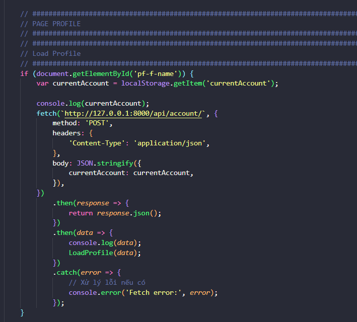
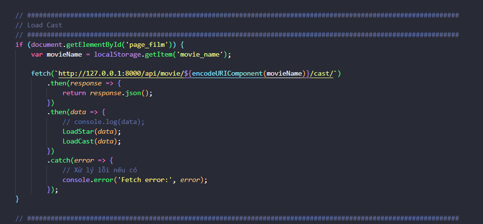
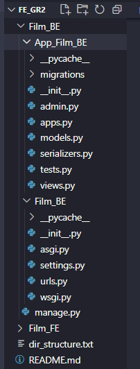

Họ - tên: Trần Hồng Quân\
MSSV: 20205114\
**Báo cáo GR2**

Giảng viên: Trương Thị Diệu Linh

**Chủ đề GR2: Phát triển website quản lý phim.**

**Phát triển chức năng tìm kiếm theo thuộc tính và xác định và thu thập
hành vi của người dùng mà cần thống kê lưu trữ để sau này có thể gợi ý.\
**

# **Mục lục** {#mục-lục .TOC-Heading}

[**1.** **Công nghệ sử dụng** [5](#_Toc156568700)](#_Toc156568700)

[**2.** **Phát triển FE** [5](#_Toc156568701)](#_Toc156568701)

[**2.1.** **Thiết kế màn hình** [5](#_Toc156568702)](#_Toc156568702)

[**2.2.** **Cấu trúc thư mục** [5](#_Toc156568703)](#_Toc156568703)

[**2.3.** **Code** [6](#_Toc156568704)](#_Toc156568704)

[**2.3.1.** **Login** [7](#_Toc156568705)](#_Toc156568705)

[**2.3.2.** **Register** [8](#_Toc156568706)](#_Toc156568706)

[**2.3.3.** **Load Film Home** [9](#_Toc156568707)](#_Toc156568707)

[**2.3.4.** **Load Profile** [18](#_Toc156568708)](#_Toc156568708)

[**2.3.5.** **Change Profile** [19](#_Toc156568709)](#_Toc156568709)

[**2.3.6.** **Load Detail** [20](#_Toc156568710)](#_Toc156568710)

[**2.3.7.** **Load Genres** [21](#_Toc156568711)](#_Toc156568711)

[**2.3.8.** **Load Director** [21](#_Toc156568712)](#_Toc156568712)

[**2.3.9.** **Load Writers** [22](#_Toc156568713)](#_Toc156568713)

[**2.3.10.** **Load Total Reviews**
[22](#_Toc156568714)](#_Toc156568714)

[**2.3.11.** **Load Cast** [23](#_Toc156568715)](#_Toc156568715)

[**2.3.12.** **Load Taglines** [23](#_Toc156568716)](#_Toc156568716)

[**2.3.13.** **Load Did you know** [24](#_Toc156568717)](#_Toc156568717)

[**2.3.14.** **Load User Review** [24](#_Toc156568718)](#_Toc156568718)

[**2.3.15.** **Load Country Origin**
[25](#_Toc156568719)](#_Toc156568719)

[**2.3.16.** **Load Official Sites**
[25](#_Toc156568720)](#_Toc156568720)

[**2.3.17.** **Load Language** [26](#_Toc156568721)](#_Toc156568721)

[**2.3.18.** **Load Filming Location**
[26](#_Toc156568722)](#_Toc156568722)

[**2.3.19.** **Load Production Companies**
[27](#_Toc156568723)](#_Toc156568723)

[**2.3.20.** **Load Box Office** [27](#_Toc156568724)](#_Toc156568724)

[**2.3.21.** **Load Director ở page Cast and Crew**
[28](#_Toc156568725)](#_Toc156568725)

[**2.3.22.** **Load Writers** [28](#_Toc156568726)](#_Toc156568726)

[**2.3.23.** **Load Cast** [29](#_Toc156568727)](#_Toc156568727)

[**2.3.24.** **Load Produced** [29](#_Toc156568728)](#_Toc156568728)

[**2.3.25.** **Load Cinematography**
[30](#_Toc156568729)](#_Toc156568729)

[**2.3.26.** **Load Editing** [30](#_Toc156568730)](#_Toc156568730)

[**2.3.27.** **Load Special Effects**
[31](#_Toc156568731)](#_Toc156568731)

[**2.3.28.** **Load Music** [31](#_Toc156568732)](#_Toc156568732)

[**2.3.29.** **Load Review ở Page User Review**
[32](#_Toc156568733)](#_Toc156568733)

[**2.3.30.** **Submit Review** [33](#_Toc156568734)](#_Toc156568734)

[**2.3.31.** **Load Award ở page Award**
[34](#_Toc156568735)](#_Toc156568735)

[**3.** **Phát triển BE** [35](#_Toc156568736)](#_Toc156568736)

[**3.1.** **Cấu trúc thư mục** [35](#_Toc156568737)](#_Toc156568737)

[**3.2.** **Model** [35](#_Toc156568738)](#_Toc156568738)

[**3.3.** **Serializers** [38](#_Toc156568739)](#_Toc156568739)

[**3.4.** **Views** [39](#_Toc156568740)](#_Toc156568740)

[**3.4.1.** **Login** [39](#_Toc156568741)](#_Toc156568741)

[**3.4.2.** **Register** [40](#_Toc156568742)](#_Toc156568742)

[**3.4.3.** **TicketListView** [41](#_Toc156568743)](#_Toc156568743)

[**3.4.4.** **ReviewView** [42](#_Toc156568744)](#_Toc156568744)

[**3.4.5.** **FilmListView** [43](#_Toc156568745)](#_Toc156568745)

[**3.4.6.** **AwardListView** [44](#_Toc156568746)](#_Toc156568746)

[**3.4.7.** **DirectorListView** [45](#_Toc156568747)](#_Toc156568747)

[**3.4.8.** **CameraListView** [46](#_Toc156568748)](#_Toc156568748)

[**3.4.9.** **CastListView** [47](#_Toc156568749)](#_Toc156568749)

[**3.4.10.** **CinematographyListView**
[48](#_Toc156568750)](#_Toc156568750)

[**3.4.11.** **EditingListView** [49](#_Toc156568751)](#_Toc156568751)

[**3.4.12.** **GenresListView** [50](#_Toc156568752)](#_Toc156568752)

[**3.4.13.** **MusicListView** [51](#_Toc156568753)](#_Toc156568753)

[**3.4.14.** **ProducedListView** [52](#_Toc156568754)](#_Toc156568754)

[**3.4.15.** **SpecialEffectsListView**
[53](#_Toc156568755)](#_Toc156568755)

[**3.4.16.** **TaglinesListView** [54](#_Toc156568756)](#_Toc156568756)

[**3.4.17.** **WritersListView** [55](#_Toc156568757)](#_Toc156568757)

[**3.4.18.** **MovieListView** [56](#_Toc156568758)](#_Toc156568758)

[**3.4.19.** **AspectRatioListView**
[57](#_Toc156568759)](#_Toc156568759)

[**3.4.20.** **CinematographicsProcessListView**
[58](#_Toc156568760)](#_Toc156568760)

[**3.4.21.** **ColorProcessListView**
[59](#_Toc156568761)](#_Toc156568761)

[**3.4.22.** **CountryOriginListView**
[60](#_Toc156568762)](#_Toc156568762)

[**3.4.23.** **DidyouknowListView**
[61](#_Toc156568763)](#_Toc156568763)

[**3.4.24.** **FilmReviewListView**
[62](#_Toc156568764)](#_Toc156568764)

[**3.4.25.** **FilmingLocationsListView**
[63](#_Toc156568765)](#_Toc156568765)

[**3.4.26.** **LaboratoryListView**
[64](#_Toc156568766)](#_Toc156568766)

[**3.4.27.** **LanguageListView** [65](#_Toc156568767)](#_Toc156568767)

[**3.4.28.** **NegativeFomatListView**
[66](#_Toc156568768)](#_Toc156568768)

[**3.4.29.** **OfficialSiteListView**
[67](#_Toc156568769)](#_Toc156568769)

[**3.4.30.** **PrintedFilmFormatListView**
[68](#_Toc156568770)](#_Toc156568770)

[**3.4.31.** **ProductionCompaniesListView**
[69](#_Toc156568771)](#_Toc156568771)

[**3.4.32.** **RatingFilmListView**
[70](#_Toc156568772)](#_Toc156568772)

[**3.4.33.** **SoundMixListView** [71](#_Toc156568773)](#_Toc156568773)

[**3.4.34.** **TicketRoomListView**
[72](#_Toc156568774)](#_Toc156568774)

[**3.4.35.** **AccountListView** [73](#_Toc156568775)](#_Toc156568775)

[**3.5.** **URL** [74](#_Toc156568776)](#_Toc156568776)

[**4.** **Chạy code** [76](#_Toc156568777)](#_Toc156568777)

[**Chạy trên BE** [76](#chạy-trên-be)](#chạy-trên-be)

[**Chạy trên FE:** [76](#chạy-trên-fe)](#chạy-trên-fe)

[**5.** **Sản phẩm** [77](#_Toc156568780)](#_Toc156568780)

[- Login: [77](#_Toc156568781)](#_Toc156568781)

[- Register: [77](#_Toc156568782)](#_Toc156568782)

[- Home: [78](#_Toc156568783)](#_Toc156568783)

[- Profile: [79](#_Toc156568784)](#_Toc156568784)

[- Detail: [79](#_Toc156568785)](#_Toc156568785)

[- Cast and Crew page [82](#_Toc156568786)](#_Toc156568786)

[- Award page [83](#_Toc156568787)](#_Toc156568787)

[- User review page [83](#_Toc156568788)](#_Toc156568788)

[- Review [84](#_Toc156568789)](#_Toc156568789)

[- Search [85](#_Toc156568790)](#_Toc156568790)

[- Admin [86](#_Toc156568791)](#_Toc156568791)

[**6.** **Kết luận** [88](#_Toc156568792)](#_Toc156568792)

1.  **\
    **[]{#_Toc156568700 .anchor}**Công nghệ sử dụng**

-   FE: HTML, CSS, Javascript, Bootstrap, Jquery

-   BE: Python, Django

> Quản lý và lưu trữ: Git, Github

2.  []{#_Toc156568701 .anchor}**Phát triển FE**

    1.  []{#_Toc156568702 .anchor}**Thiết kế màn hình**

-   Tham khảo giao diện của trang chính nơi crawl:
    <https://www.imdb.com/?ref_=nv_home>

    1.  []{#_Toc156568703 .anchor}**Cấu trúc thư mục**

-   Tạo thư mục Film_FE chứa tất cả code FE trong này

-   Phân chia Film_FE ra 3 thư mực nhỏ:

```{=html}
<!-- -->
```
-   media: Chứa các hình ảnh, video

-   static: Chứa các tệp tĩnh, CSS và JS

-   templates: Chứa các tệp HTML

{width="4.233699693788276in"
height="6.042190507436571in"}

Hình ảnh cấu trúc thư mục FE sau khi đã thiết kế xong

1.  []{#_Toc156568704 .anchor}**Code**

-   Nhìn vào templates mẫu và định hướng HTML gồm những element nào và
    khởi tạo, chú ý đặt tên id cho hợp lý để sau này kết hợp cùng BE

-   CSS: Kết hợp với bootstrap để code nhanh hơn

-   JS: Viết những câu lệnh JS đơn giản cho từng trang, sau đó mới vào
    tới api

**Phân tích Fetch API ở FE**

1.  []{#_Toc156568705 .anchor}**Login**

> {width="6.5in"
> height="5.863194444444445in"}

-   Lấy username từ việc nhập vào

-   Lấy password từ việc nhập vào

-   Thực hiện yêu cầu HTTP POST lên URL:
    <http://127.0.0.1:8000/api/login/> với username và password

-   Nhận thông điệp thành công hoặc thất bại

-   Nếu thành công thì lưu account đấy vào localStorage và chuyển tới
    home

    1.  []{#_Toc156568706 .anchor}**Register**

{width="6.5in"
height="6.344444444444444in"}

-   Lấy account, name, gmail, password và confirm password từ việc nhập
    vào

-   Thực hiện yêu cầu HTTP POST lên URL:
    <http://127.0.0.1:8000/api/register/> với các trường thông tin đã
    nhập

-   Nhận thông điệp thành công hoặc lỗi

    1.  []{#_Toc156568707 .anchor}**Load Film Home**

{width="4.50872375328084in"
height="4.1170231846019245in"}

-   Gửi yêu cầu HTTP GET, nhận data là toàn bộ film

-   Đưa 3 phim vào thanh bên phải video

-   Lắng nghe sự kiện Search của NavBar

-   Đưa 12 phim vào danh sách MostPopular

-   Đưa 12 phim vào danh sách MostFavourites

-   Lắng nghe sự kiện click chuột vào Card để lưu trữ Movie_name vào
    localStorage

**\
**

-   **LoadFilmHome**

{width="6.5in"
height="5.988194444444445in"}

{width="6.5in"
height="5.166666666666667in"}

**\
**

-   **LoadFilmNav:**

{width="6.5in"
height="7.261805555555555in"}

{width="6.5in"
height="7.209027777777778in"}

**\
**

-   **MostPopularHome:**

{width="6.5in"
height="6.154166666666667in"}

{width="6.5in"
height="5.143055555555556in"}
{width="6.5in"
height="5.135416666666667in"}

-   **MostFavouritesHome: Tương tự MostPolularHome**

-   **toDetail:**

{width="6.5in"
height="5.340277777777778in"}

**\
**

1.  []{#_Toc156568708 .anchor}**Load Profile**

{width="5.908845144356955in"
height="5.33379593175853in"}

-   Lấy account lưu trong localStorage ra và yêu cầu lên HTTP để lấy
    thông tin

-   Nhận được thông tin thì đưa vào các thẻ HTML

    1.  []{#_Toc156568709 .anchor}**Change Profile**

{width="6.5in"
height="5.434027777777778in"}

-   Yêu cầu HTTP POST với body là first_name, last_name, email, id

-   Nhận thông điệp thành công hoặc thất bại

-   Load lại trang để làm mới thông tin

**\
**

1.  []{#_Toc156568710 .anchor}**Load Detail**

{width="6.5in"
height="4.636805555555555in"}

-   Khi vào trang Detail, việc đầu tiên là yêu cầu HTTP POST lên để lấy
    toàn bộ thông tin về 1 bộ phim nhất định, tên phim được lấy từ
    localStorage đã được lưu từ trước

-   Nhận data và LoadDetail (Phần trên)

**\
**

1.  []{#_Toc156568711 .anchor}**Load Genres**

{width="6.5in"
height="3.341666666666667in"}

-   Yêu cầu HTTP GET để lấy thông tin của Genres và xử lý, đưa thông tin
    vào các thể HTML đã quy định

    1.  []{#_Toc156568712 .anchor}**Load Director**

{width="6.5in"
height="2.7576388888888888in"}

**\
**

2.  []{#_Toc156568713 .anchor}**Load Writers**

{width="6.5in"
height="2.847916666666667in"}

3.  []{#_Toc156568714 .anchor}**Load Total Reviews**

{width="6.5in"
height="2.723611111111111in"}

**\
**

4.  []{#_Toc156568715 .anchor}**Load Cast**

{width="6.5in"
height="3.0256944444444445in"}

5.  []{#_Toc156568716 .anchor}**Load Taglines**

{width="6.5in"
height="2.8868055555555556in"}

**\
**

6.  []{#_Toc156568717 .anchor}**Load Did you know**

{width="6.5in"
height="2.8090277777777777in"}

7.  []{#_Toc156568718 .anchor}**Load User Review**

{width="6.5in"
height="2.9291666666666667in"}

**\
**

8.  []{#_Toc156568719 .anchor}**Load Country Origin**

{width="6.5in"
height="2.713888888888889in"}

9.  []{#_Toc156568720 .anchor}**Load Official Sites**

{width="6.5in"
height="2.9993055555555554in"}

**\
**

10. []{#_Toc156568721 .anchor}**Load Language**

{width="6.5in"
height="2.75in"}

11. []{#_Toc156568722 .anchor}**Load Filming Location**

{width="6.5in"
height="2.953472222222222in"}

**\
**

12. []{#_Toc156568723 .anchor}**Load Production Companies**

{width="6.5in"
height="2.9402777777777778in"}

13. []{#_Toc156568724 .anchor}**Load Box Office**

{width="6.5in"
height="2.861111111111111in"}

**\
**

14. []{#_Toc156568725 .anchor}**Load Director ở page Cast and Crew**

{width="6.5in"
height="3.3381944444444445in"}

15. []{#_Toc156568726 .anchor}**Load Writers**

{width="6.5in"
height="2.939583333333333in"}

**\
**

16. []{#_Toc156568727 .anchor}**Load Cast**

{width="6.5in"
height="2.7534722222222223in"}

17. []{#_Toc156568728 .anchor}**Load Produced**

{width="6.5in"
height="2.938888888888889in"}

**\
**

18. []{#_Toc156568729 .anchor}**Load Cinematography**

{width="6.5in"
height="2.984722222222222in"}

19. []{#_Toc156568730 .anchor}**Load Editing**

{width="6.5in"
height="2.60625in"}

**\
**

20. []{#_Toc156568731 .anchor}**Load Special Effects**

{width="6.5in"
height="2.7645833333333334in"}

21. []{#_Toc156568732 .anchor}**Load Music**

{width="6.5in"
height="2.7222222222222223in"}

**\
**

22. []{#_Toc156568733 .anchor}**Load Review ở Page User Review**

{width="6.5in"
height="3.4694444444444446in"}

**\
**

23. []{#_Toc156568734 .anchor}**Submit Review**

{width="6.5in"
height="5.139583333333333in"}

{width="6.5in"
height="2.297222222222222in"}

-   Nhận thông tin từ người dùng bao gồm: Số sao đánh giá, tiêu đề, nội
    dung

-   Yêu cầu HTTP POST với các trường thông tin: name_review,
    star_review, title_review, content_review, movie

    1.  []{#_Toc156568735 .anchor}**Load Award ở page Award**

{width="6.5in"
height="3.497916666666667in"}

**\
**

3.  []{#_Toc156568736 .anchor}**Phát triển BE**

    1.  []{#_Toc156568737 .anchor}**Cấu trúc thư mục**

{width="1.6834787839020122in"
height="4.43371719160105in"}

-   Thư mục Film_BE chứa toàn bộ code BE

-   Thư mục con Film_BE nằm trong Film_BE chứa cấu hình Django và url.py
    chứa các đường dẫn

-   Thư mục con App_Film_BE chứa model, serializers, views và admin

    1.  []{#_Toc156568738 .anchor}**Model**

{width="2.383540026246719in"
height="4.4253838582677165in"}

{width="2.2668635170603673in"
height="4.567062554680665in"} {width="2.2251924759405073in"
height="1.0250885826771654in"}

-   Mỗi bảng trong database là một model ở trong code

-   Ví dụ model Movieinformation:

{width="5.967183945756781in"
height="3.5086373578302714in"}

1.  []{#_Toc156568739 .anchor}**Serializers**

{width="3.9170056867891514in"
height="6.167201443569554in"}

-   Import các model, định dạng dữ liệu đầu ra, định dạng JSON

    1.  []{#_Toc156568740 .anchor}**Views**

-   Import toàn bộ Model và Serializer

-   Xử lý toàn bộ sự kiện của URL

    1.  []{#_Toc156568741 .anchor}**Login**

{width="6.467226596675416in"
height="4.017014435695538in"}

-   Lấy dữ liệu nhận từ FE

-   Đăng nhập bằng model User của Django

    1.  []{#_Toc156568742 .anchor}**Register**

{width="6.5in"
height="6.615972222222222in"}

-   Nhận thông tin từ FE

-   Check tài khoản đã tồn tại hay chưa

-   Check độ dài password

-   Tạo tài khoản mới

-   Thêm vào Follow để theo dõi sự kiện click chuột vào phim

    1.  []{#_Toc156568743 .anchor}**TicketListView**

{width="6.5in"
height="3.486111111111111in"}

**\
**

2.  []{#_Toc156568744 .anchor}**ReviewView**

{width="6.5in"
height="5.253472222222222in"}
{width="5.21711832895888in"
height="3.0419302274715663in"}

3.  []{#_Toc156568745 .anchor}**FilmListView**

{width="6.5in"
height="5.500694444444444in"}

**\
**

4.  []{#_Toc156568746 .anchor}**AwardListView**

{width="6.208871391076116in"
height="5.133778433945757in"}

**\
**

5.  []{#_Toc156568747 .anchor}**DirectorListView**

{width="6.5in"
height="6.0680555555555555in"}

**\
**

6.  []{#_Toc156568748 .anchor}**CameraListView**

{width="6.117197069116361in"
height="5.558814523184602in"}

**\
**

7.  []{#_Toc156568749 .anchor}**CastListView**

{width="6.117197069116361in"
height="6.058858267716535in"}

**\
**

8.  []{#_Toc156568750 .anchor}**CinematographyListView**

{width="6.5in"
height="5.918055555555555in"}

**\
**

9.  []{#_Toc156568751 .anchor}**EditingListView**

{width="6.5in"
height="5.790972222222222in"}

**\
**

10. []{#_Toc156568752 .anchor}**GenresListView**

{width="6.208871391076116in"
height="5.908845144356955in"}

**\
**

11. []{#_Toc156568753 .anchor}**MusicListView**

{width="6.308880139982502in"
height="6.00051946631671in"}

**\
**

12. []{#_Toc156568754 .anchor}**ProducedListView**

{width="6.5in"
height="5.788888888888889in"}

**\
**

13. []{#_Toc156568755 .anchor}**SpecialEffectsListView**

{width="6.5in"
height="6.129166666666666in"}

**\
**

14. []{#_Toc156568756 .anchor}**TaglinesListView**

{width="6.5in"
height="6.0375in"}

**\
**

15. []{#_Toc156568757 .anchor}**WritersListView**

{width="6.5in"
height="5.5368055555555555in"}

**\
**

16. []{#_Toc156568758 .anchor}**MovieListView**

{width="6.5in"
height="5.117361111111111in"}

{width="6.5in"
height="3.15in"}

17. []{#_Toc156568759 .anchor}**AspectRatioListView**

{width="6.5in"
height="4.841666666666667in"}

**\
**

18. []{#_Toc156568760 .anchor}**CinematographicsProcessListView**

{width="6.5in"
height="4.081944444444445in"}

**\
**

19. []{#_Toc156568761 .anchor}**ColorProcessListView**

{width="6.367218941382327in"
height="5.058771872265967in"}

**\
**

20. []{#_Toc156568762 .anchor}**CountryOriginListView**

{width="6.5in"
height="4.418055555555555in"}

**\
**

21. []{#_Toc156568763 .anchor}**DidyouknowListView**

{width="6.5in"
height="4.836805555555555in"}

**\
**

22. []{#_Toc156568764 .anchor}**FilmReviewListView**

{width="6.5in"
height="4.853472222222222in"}

**\
**

23. []{#_Toc156568765 .anchor}**FilmingLocationsListView**

{width="6.5in"
height="4.029166666666667in"}

**\
**

24. []{#_Toc156568766 .anchor}**LaboratoryListView**

{width="6.5in"
height="4.799305555555556in"}

**\
**

25. []{#_Toc156568767 .anchor}**LanguageListView**

{width="6.5in"
height="5.135416666666667in"}

**\
**

26. []{#_Toc156568768 .anchor}**NegativeFomatListView**

{width="6.5in"
height="4.402777777777778in"}

**\
**

27. []{#_Toc156568769 .anchor}**OfficialSiteListView**

{width="6.5in"
height="4.559027777777778in"}

**\
**

28. []{#_Toc156568770 .anchor}**PrintedFilmFormatListView**

{width="6.5in"
height="3.9347222222222222in"}

**\
**

29. []{#_Toc156568771 .anchor}**ProductionCompaniesListView**

{width="6.5in"
height="4.1875in"}

**\
**

30. []{#_Toc156568772 .anchor}**RatingFilmListView**

{width="6.5in"
height="4.664583333333334in"}

**\
**

31. []{#_Toc156568773 .anchor}**SoundMixListView**

{width="6.5in"
height="4.68125in"}

**\
**

32. []{#_Toc156568774 .anchor}**TicketRoomListView**

{width="6.5in"
height="5.975in"}

**\
**

33. []{#_Toc156568775 .anchor}**AccountListView**

{width="6.5in"
height="6.293055555555555in"}

**\
**

1.  []{#_Toc156568776 .anchor}**URL**

-   Import toàn bộ view

{width="3.8753357392825896in"
height="6.908931539807524in"}

-   URL:

{width="6.5in"
height="4.615277777777778in"}

**\
**

4.  []{#_Toc156568777 .anchor}**Chạy code**

## **Chạy trên BE**

-   Vào Filder Film_BE và runcode bằng câu lệnh sau

> {width="5.867175196850393in"
> height="0.8500732720909886in"}
>
> {width="6.0838604549431325in"
> height="2.016841644794401in"}

-   Lúc này server đã chạy ở cổng: <http://127.0.0.1:8000/>

## **Chạy trên FE:**

-   Vào Folder Film_FE rồi nhấn vào Go Live:

> {width="1.4834623797025372in"
> height="0.8000688976377953in"}
>
> {width="4.4837215660542435in"
> height="0.6000524934383202in"}

-   Lúc này FE đã chạy ở cổng: <http://127.0.0.1:5500/>

5.  []{#_Toc156568780 .anchor}**Sản phẩm**

-   []{#_Toc156568781 .anchor}Login:

> {width="6.5in"
> height="3.459722222222222in"}

-   []{#_Toc156568782 .anchor}Register:

> {width="6.5in"
> height="3.459722222222222in"}

**\
**

-   []{#_Toc156568783 .anchor}Home:

> {width="6.5in"
> height="3.459722222222222in"}{width="6.5in"
> height="3.4569444444444444in"}

**\
**

-   []{#_Toc156568784 .anchor}Profile:

> {width="6.5in"
> height="3.459722222222222in"}

-   []{#_Toc156568785 .anchor}Detail:

> {width="6.5in"
> height="3.4631944444444445in"}
>
> {width="6.5in"
> height="3.4569444444444444in"}
>
> {width="6.5in"
> height="3.45in"}
>
> {width="6.5in"
> height="3.453472222222222in"}
>
> {width="6.5in"
> height="3.484722222222222in"}
>
> {width="6.5in"
> height="3.453472222222222in"}

-   []{#_Toc156568786 .anchor}Cast and Crew page

> {width="6.5in"
> height="3.4631944444444445in"}

**\
**

-   []{#_Toc156568787 .anchor}Award page

> {width="6.5in"
> height="3.459722222222222in"}

-   []{#_Toc156568788 .anchor}User review page

> {width="6.5in"
> height="3.459722222222222in"}

**\
**

-   []{#_Toc156568789 .anchor}Review

> {width="6.5in"
> height="3.453472222222222in"}
>
> {width="6.5in"
> height="3.459722222222222in"}

**\
**

-   []{#_Toc156568790 .anchor}Search

```{=html}
<!-- -->
```
-   Theo tên:

> {width="6.5in"
> height="3.453472222222222in"}

-   Theo năm sản xuất

> {width="6.5in"
> height="3.45in"}

-   Theo rating

> {width="6.5in"
> height="3.4569444444444444in"}

-   []{#_Toc156568791 .anchor}Admin

> {width="6.5in"
> height="3.4569444444444444in"}
>
> {width="6.5in"
> height="3.45in"}

**\
**

6.  []{#_Toc156568792 .anchor}**Kết luận**

> Dự án quản lý phim ảnh đã đạt được một số kết quả tích cực và còn tiềm
> ẩn nhiều cơ hội để phát triển trong tương lai. Dưới môi trường local,
> sản phẩm đã thể hiện sự ổn định và hoạt động khá tốt, làm tốt nhiệm vụ
> quản lý và hiển thị thông tin về phim ảnh.
>
> Điểm mạnh đáng chú ý của dự án là sự kết hợp tốt giữa Frontend (FE) và
> Backend (BE). Sự liên kết chặt chẽ giữa hai phần này là quan trọng để
> đảm bảo hoạt động mượt mà và hiệu quả của hệ thống. Sự tương tác hài
> hòa giữa giao diện người dùng và phần xử lý dữ liệu từ máy chủ đã mang
> lại trải nghiệm người dùng tích cực.
>
> Tuy nhiên, để nâng cao chất lượng và tính năng của sản phẩm, cần thêm
> nhiều chức năng hơn. Việc phát triển thêm tính năng có thể bao gồm cải
> thiện giao diện người dùng, thêm các chức năng tìm kiếm, phân loại
> hoặc tích hợp tính năng xem trước phim. Điều này sẽ làm gia tăng giá
> trị và sự hấp dẫn của sản phẩm đối với người sử dụng.
>
> Tóm lại, với sự ổn định hiện tại và tiềm năng phát triển trong tương
> lai, dự án quản lý phim ảnh đã đặt nền tảng cho một sản phẩm có thể
> đáp ứng nhu cầu ngày càng tăng của người dùng với thế giới giải trí
> số.
